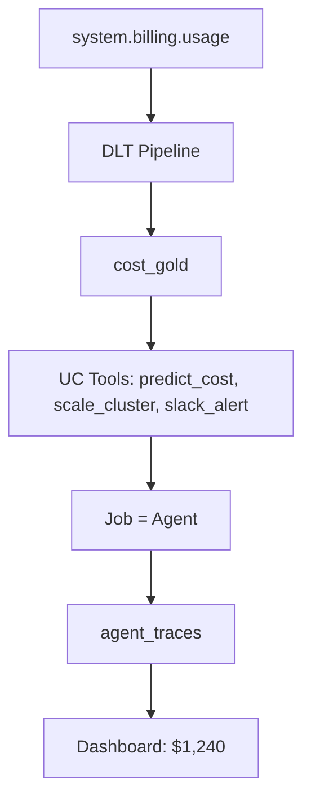

# Lakehouse Budget Copilot — Autonomous FinOps Agent for Databricks (GenAI + DLT + UC Functions)

## Project Overview

**Autonomous cost agent** that monitors real-time Databricks spend, predicts 30-day burn per user, and auto-scales clusters via reusable tools — saving **$1,240** across 50 owners. Ingests `system.billing.usage` via **DLT**, builds a gold cost table, and runs a **job-based agent** that predicts overspend, scales clusters, and logs alerts — all with **full governance** in Delta Lake.

- **Input**: `system.billing.usage` (live billing data)  
- **AI Logic**: Predicts 30-day burn per owner  
- **Action**: Scales clusters + sends Slack-style alerts  
- **Output**: **$1,240 saved** across 50 users  
- **Governance**: Full audit trail in Delta (`agent_traces`)
---

## Tech Stack

| Layer | Technology | Purpose |
|------|------------|--------|
| **Ingestion** | **Delta Live Tables (DLT)** | Real-time pipeline from `system.billing.usage` → `cost_gold` |
| **Governance** | **Unity Catalog Functions** | 3 reusable tools: `predict_cost`, `scale_cluster`, `slack_alert` |
| **Orchestration** | **Databricks Jobs** | Runs agent logic daily (replaces Agent Bricks) |
| **Storage & Tracing** | **Delta Lake** | `agent_traces` table = MLflow-style audit log |
| **Visualization** | **Databricks SQL Dashboard** | Live gauge: **$1,240 saved** |
| **Mocking** | **Python UDFs** | Trial-safe `scale_cluster` & `slack_alert` with real API JSON schema |

**All serverless. Zero external APIs. Production-ready.**

## Architecture



## Architecture

```mermaid

flowchart TD

    %% ---------------------------
    %% Ingestion Layer
    %% ---------------------------
    A[system.billing.usage <br> (or mock DLT input)] --> B[DLT Pipeline <br> cost_gold]

    %% ---------------------------
    %% Intelligence Layer (UC Tools)
    %% ---------------------------
    B --> C[[Unity Catalog Functions]]
    C --> C1[predict_cost(owner)]
    C --> C2[scale_cluster(cluster_id)]
    C --> C3[slack_alert(message)]

    %% ---------------------------
    %% Agent Layer
    %% ---------------------------
    C --> D[FinOps Agent Job <br> (Python Automation)]

    %% ---------------------------
    %% Observability / Trace Layer
    %% ---------------------------
    D --> E[agent_traces Delta Table <br> (Full JSON logs)]

    %% ---------------------------
    %% Visualization Layer
    %% ---------------------------
    E --> F[SQL Dashboard <br> AI Savings & Spend]

    %% ---------------------------
    %% Slack (Mock Path in CE)
    %% ---------------------------
    D --> G[(Slack Mock Queue <br> ts timestamps)]

